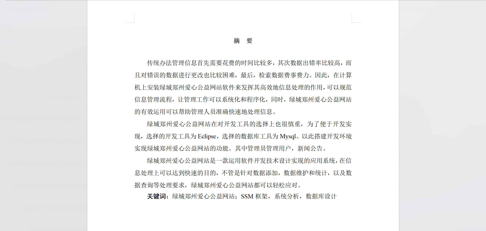
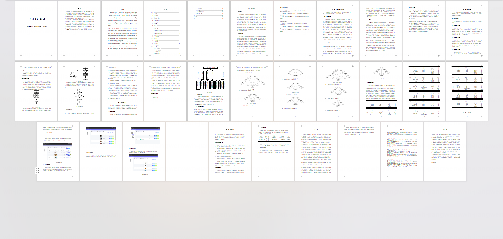
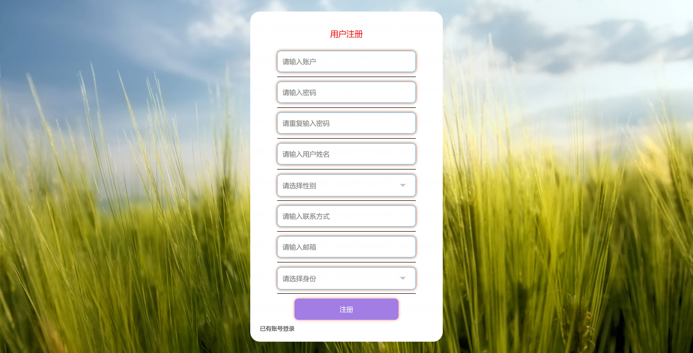
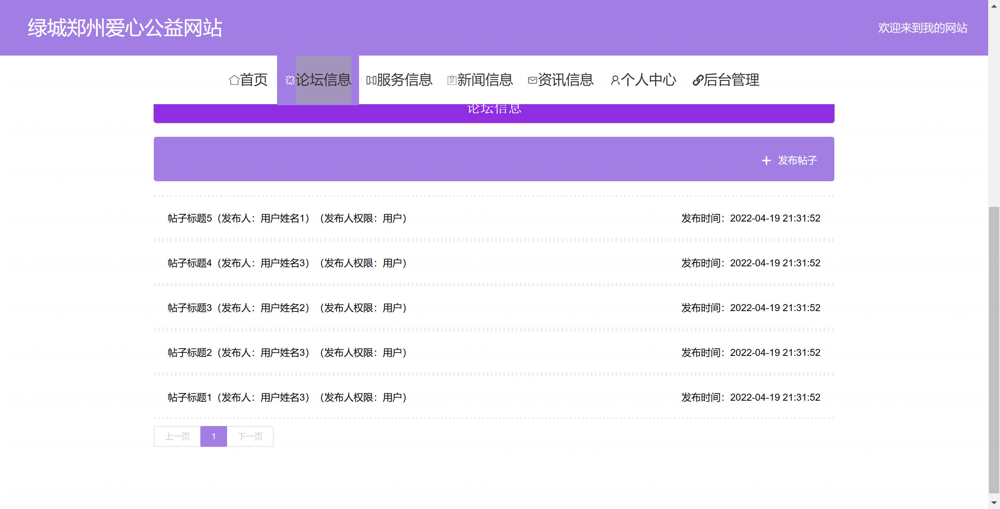
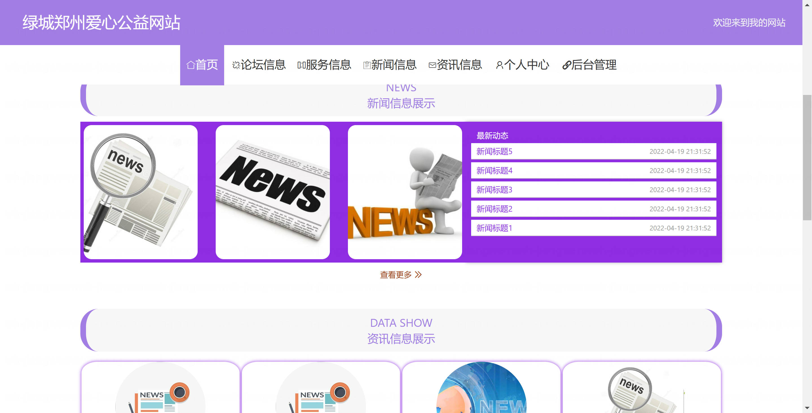
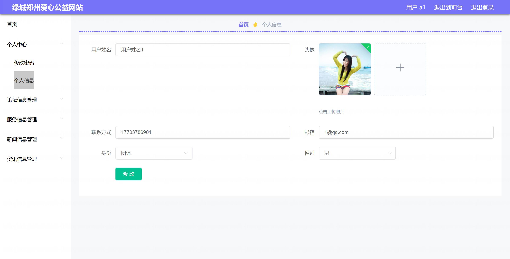
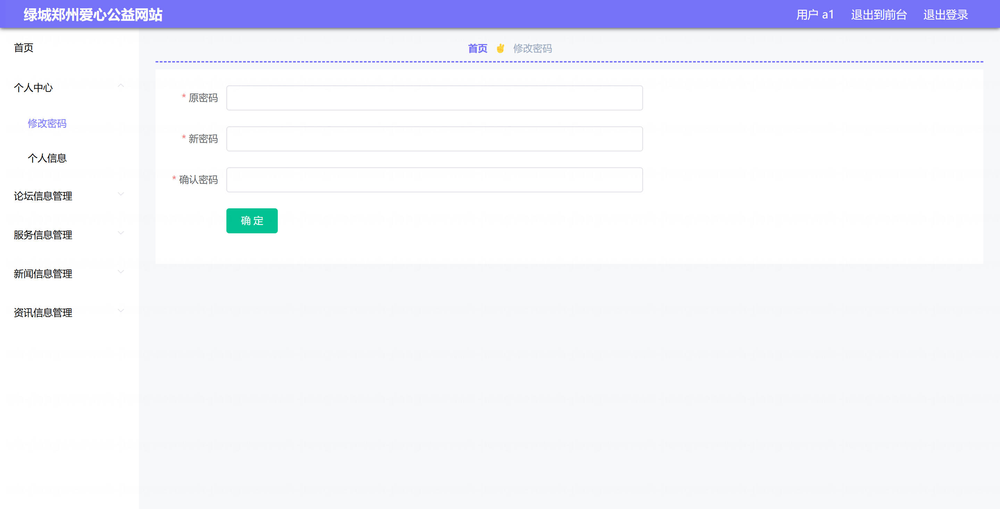
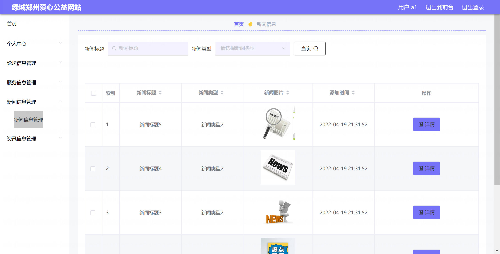
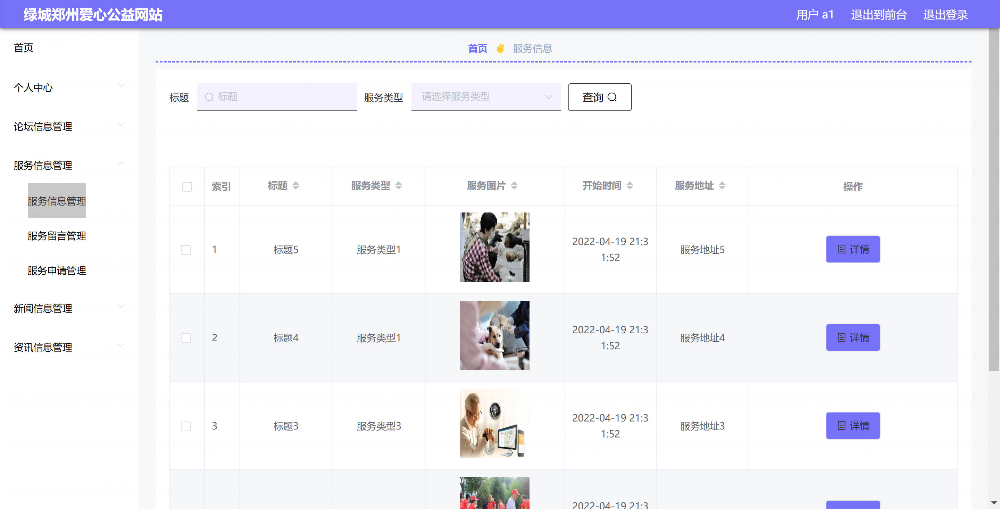
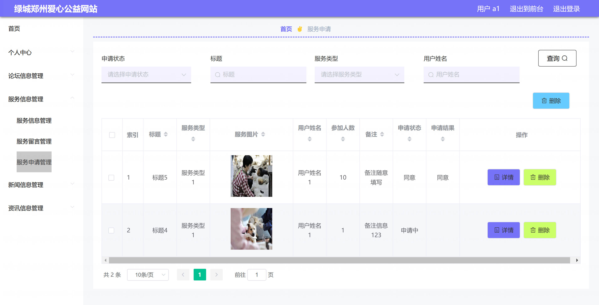

<h1 align="center">基于Spring Boot 的绿城郑州爱心公益管理系统【带论文】</h1>

- <b>完整代码获取地址：从戎源码网 ([https://armycodes.com/](https://armycodes.com/))</b>
- <b>技术探讨、资料分享，请加QQ群：692619798</b>
- <b>作者微信：19941326836  QQ：3645296857</b>
- <b>承接计算机毕业设计、Java毕业设计、Python毕业设计、深度学习、机器学习</b>
- <b>选题+开题报告+任务书+程序定制+安装调试+论文+答辩ppt 一条龙服务</b>
- <b>所有选题地址 ([https://github.com/Descartes007/allProject](https://github.com/Descartes007/allProject)) </b>

## 一、项目介绍

### 基于 Spring Boot 的绿城郑州爱心公益管理系统，分为后台管理端（管理员）与前端用户端（普通用户），主要功能如下：
### 管理员（后台）：系统的管理角色，负责全站数据维护与审核。主要功能：
- 系统管理：登录、登出、修改密码、获取/修改个人信息、会话/token 管理。
- 用户管理：用户列表/分页、查看/新增/修改/删除用户、重置密码、获取在线/会话信息。
### 内容管理（CMS）：新闻、资讯（Zixun）管理：列表/分页、详情、添加、编辑、删除。
### 论坛管理：帖子管理（列表/详情/新增/编辑/删除）、审核/回复/级联父子关系处理。
- 服务管理：服务信息（CRUD）、服务订单管理（列表、详情、审核、删除）。
- 留言/评价管理：服务留言管理、查看与维护。
### 普通用户（前端）：面向公众的使用者，主要功能：
### 认证与个人中心：注册、登录、登出、修改密码、查看/编辑个人信息、查看会话。
- 内容浏览与互动：查看新闻/资讯列表与详情、参与论坛（发帖/查看/评论）
- 服务预约与订单：查看服务信息、提交服务申请（下单）、查看/管理个人订单。
- 留言与反馈：对服务发布留言、查看留言记录。

## 二、项目技术

- 编程语言：Java（后端）
- 项目架构：B/S 架构
- 前端技术：Vue 2（vue-cli），Element UI，vue-router，axios
- 后端技术：，Spring Boot 2.2.x，MyBatis / MyBatis-Plus，MySQL（JDBC 驱动），Fastjson

## 三、运行环境

- JDK版本：1.8及以上都可以
- 操作系统：Windows7/10、MacOS
- 开发工具：IDEA、Ecplise、MyEclipse都可以

## 四、数据库配置文件

- npm版本：6.14.13及以上都可以
- Redis版本：3.2.100及以上都可以
- 文件名：application.yml
- 编码类型：utf8

## 论文截图

## 系统截图

